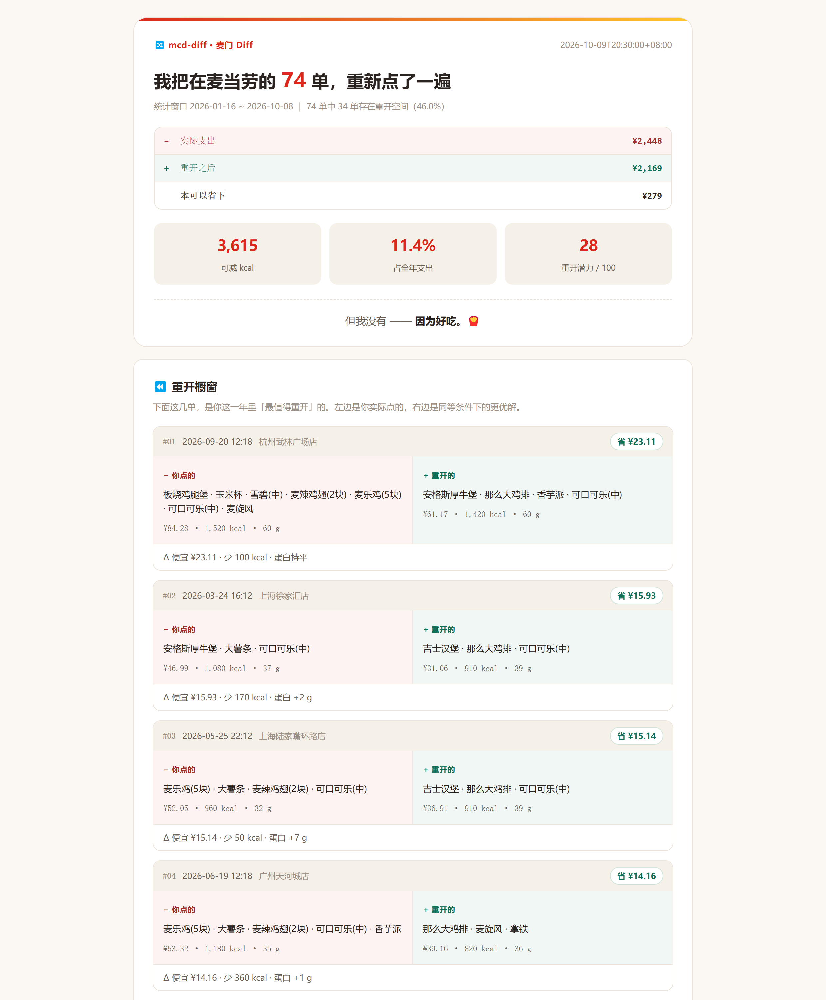

<h1 align="center">🔀 mcd-diff · 麦门 Diff</h1>

<p align="center"><b>把你的麦当劳账单，跑一遍 diff。</b></p>

<p align="center">
  
  
  
  
  
  
</p>

```diff
  2026-09-20 12:18 · 杭州武林广场店
- 板烧鸡腿堡 · 玉米杯 · 雪碧(中) · 麦辣鸡翅(2块) · 麦乐鸡(5块) · 可口可乐(中) · 麦旋风
+ 安格斯厚牛堡 · 那么大鸡排 · 香芋派 · 可口可乐(中)
  ¥84.28 → ¥61.17      便宜 ¥23.11 · 少 100 kcal · 蛋白持平
```

```diff
- 这一年我实际支付   ¥2,448
+ 重开之后          ¥2,169
  本可以省下        ¥279（11.4%）
  本可以少吃        3,615 kcal
```

**但我没有 —— 因为好吃。** 🍟

<p align="center">
  
</p>

> ↑ 示例报告（虚构数据）。完整产物见 [`examples/sample_diff.html`](examples/sample_diff.html)，可直接双击打开。

---

## ⚡ 30 秒看懂它和别的项目有什么不一样

榜单上的省钱类项目帮你算**下一单怎么买**，热量类项目帮你算**这一餐吃多少**。
我们做的事完全不同：**把已经发生的历史订单，一单不落地重新点一遍。**

| | 省钱类 | 热量类 | 年度总结类 | **麦门 Diff** |
|---|---|---|---|---|
| **时态** | 现在 | 现在 | 过去 · 聚合 | **过去 · 反事实** |
| **在问什么** | 我该买什么 | 我该吃多少 | 我做了什么 | **我本该做什么** |
| **作用对象** | 未来一单 | 未来一单 | 历史总计 | **历史逐单重算** |
| **输出** | 方案文本 | 方案文本 | 人格标签 | **差额 + 平行对照** |
| **可验证性** | 弱 | 弱 | 弱 | **强 —— 每一单都能复算** |

**一句话**：省钱类是「下单前的军师」，年度总结是「年终的司仪」，我们是 **「逐单复盘的教练」** ——
用的不是建议，是**你自己的订单**。

> 为什么没人做这个？因为大多数人只敢对"未来"给建议。对已经花掉的钱做复盘，
> 需要一套**约束足够严谨**的算法 —— 否则就是在指手画脚。见下一节。

---

## 🔒 三条自我约束（这是它敢叫「重开」的原因）

这不是"教你省钱"的工具。三条硬约束决定了它对用户的态度：

### ① 约束天花板 = **这一单自己**

```text
预算上限 = 该单的实付金额      → 不劝你少花
热量上限 = 该单的实际热量      → 不劝你少吃
蛋白质下限 = 该单的实际蛋白    → 不让营养变差
```

如果像省钱类那样解"最小化价格"，必然推出"什么都别点最省"；
像热量类那样解"最小化热量"，必然推出"只喝零度可乐最轻"。

我们把上限**锁定为该单原有的值**，只问一句话：

> **「同样的钱、同样的热量，能不能吃得更好？」**

因此输出永远是**同条件更优解**，不是"你该少花"。

**一个自洽性**：因为预算上限 = 该单实付，所以 `Δcost ≥ 0` 数学上必然成立 —— 不需要任何裁剪。

### ② 品类保留 —— 不做"把饮料删掉"式的伪优化

第一版跑出来的建议是这样的：

```diff
- 猪柳蛋麦满分 · 鲜煮咖啡    ¥28
+ 猪柳蛋麦满分              ¥16      ← 省了 ¥12，但你的咖啡没了
```

**这不叫更优解，这叫少给东西。** 所以求解器加了品类约束：
**原单有饮料，重开就必须也有饮料。**

```diff
- 猪柳蛋麦满分 · 鲜煮咖啡    ¥28
+ 吉士蛋麦满分 · 鲜煮咖啡    ¥27      ← 结构不变，品类齐全
```

用户想喝咖啡，但未必要喝**这一杯**咖啡 —— 换一杯更便宜的是优化；
直接把咖啡取消，是耍流氓。

### ③ 口径对齐 —— 让"重开价"和"实付"可比

订单实付里含优惠，而菜单标的是原价。拿实付去卡原价菜单，会得到一堆"无解"。

所以我们按**该单自身的折扣系数缩放菜单价格**，等价于假设：

> 「那天的优惠力度不变，换个点法会怎样。」

实测这一步让可解率从 45% 提升到 **100%**。

---

## ✨ 五大模块

### 1 · ⏪ 重开橱窗

一单一单左右对照，左边是你实际点的，右边是同等条件下的更优解。

```diff
  #01  2026-09-20 · 杭州武林广场店
- 板烧鸡腿堡 · 玉米杯 · 雪碧(中) · 麦辣鸡翅(2块) · 麦乐鸡(5块) · 可口可乐(中) · 麦旋风
+ 安格斯厚牛堡 · 那么大鸡排 · 香芋派 · 可口可乐(中)
  ¥84.28 → ¥61.17    便宜 ¥23.11 · 少 100 kcal · 蛋白持平
```

### 2 · 💸 差额账簿

| 指标 | 示例值 |
|---|---|
| 可节省空间 | **¥279**（占全年 11.4%） |
| 可减热量 | 3,615 kcal |
| 蛋白净变化 | +88 g |
| 单均可省 | ¥8.2 |
| 重开潜力 | 28 / 100 |
| 有重开空间的单 | 34 / 74 |

再按时段、渠道两个维度归因 —— 实测**深夜单**的可节省率最高（≈22%），远高于早餐（≈1%）。

### 3 · 🧭 三条重开路线

**约束完全相同，只有目标函数不同** —— 所以结果天然可对照。
同一段历史，你想把它重开成什么样？

| 路线 | 目标函数 | 可省金额 | 可减热量 | 蛋白净变化 |
|---|---|---:|---:|---:|
| **省钱向**（默认） | 价格最低 | **¥279** | 3,615 kcal | +88 g |
| 扎实向 | 蛋白质最高 | ¥77 | 1,540 kcal | **+369 g** |
| 轻负担向 | 热量最低 | ¥174 | **8,525 kcal** | +36 g |

> 这张表本身就是产品价值：**"省钱"和"吃得扎实"是两件事**，
> 而市面上所有工具都只给你一个答案。

### 4 · 🌀 平行宇宙

把重开后的订单集重新送进人格引擎，再和现实做一次并排：

| | 现实宇宙 | 平行宇宙 |
|---|---|---|
| 年支出 | ¥2,448 | **¥2,169** |
| 客单价 | ¥33.1 | ¥29.3 |

> 你少花的 ¥279，相当于 **8.4 顿**麦当劳。

### 5 · 🔀 diff 语法

整个报告用 `diff` 表达，README 也是。**这不只是视觉修辞** ——
`-` / `+` / `Δ` 让"到底改了什么"变成一眼可见的结构，也是这个项目名字的来源。

---

## 🎯 目标用户

- **想知道自己一年"花值了没有"的麦门老客** —— 不是被说教，而是拿到一份可验证的复盘。
- **既想省钱又不想被剥夺选择的人** —— 品类约束保证"结构不变，只是换个更划算的等效组合"。
- **内容创作者** —— 报告本身是一份能直接发出去的 diff 素材。
- **开发者** —— 一份「约束驱动 + 可解释 + 完全确定性」的反事实分析实现范式。

---

## 🏗️ 架构与工作流

```text
┌──────────────┐   ① 采集   ┌──────────────────┐
│ WorkBuddy    │ ─────────▶ │ .mcd-diff/       │
│ 麦当劳 MCP    │  JSON 落盘 │ raw.json         │
└──────────────┘            └────────┬─────────┘
                                     │ ② 本地计算（纯标准库，无网络）
                                     ▼
        ┌──────────────────────────────────────────────────┐
        │ metrics  → 原有统计（时段 / 渠道 / 人格特征）        │
        │ menu     → 菜单与营养表（含 category）             │
        │ solver   → 双约束求解 + **品类保留**               │
        │ regret   → **逐单重开 → Δcost / Δkcal / Δprotein** │
        │ persona  → 现实人格 vs 平行宇宙人格                 │
        └───────────────────────┬──────────────────────────┘
                                │ ③ 渲染
                                ▼
                 📄 麦门 Diff 报告（自包含 HTML / MD / JSON）
```

**设计原则**

- **采集与计算分离**：MCP 只负责取数落盘；计算层零网络、零依赖、可单测、可复现。
- **Agent 是编排者，不是计算器**：LLM 调用工具与叙述；确定性算法负责差额与求解。
- **只读边界**：全程不调用任何交易类工具，`assert_readonly()` 硬拦截。
- **默认离线**：产物是一个可双击打开的 HTML，不联网、不上传。

### 算法复杂度

菜单 24 项 × 一餐 ≤ 4 件 = **12,950 种组合/单**。
对 74 单做全量重开 ≈ **96 万次组合枚举**，纯 Python 约 **1.9 秒**。
**全枚举即精确最优，零启发式、完全确定性、可单测。**

---

## 🔌 用到的麦当劳 MCP Tools

| 阶段 | MCP Tool | 用途 |
|---|---|---|
| 时间基准 | `now-time-info` | 确定报告周期与"距今"表述 |
| **订单主数据** | `order-list` | 拉取近一年到店 / 外送订单（**重开的输入**） |
| 订单明细 | `query-order` | 补齐单笔商品与金额 |
| **菜单** | `query-meals` | 求解器输入：在售餐品、编码、价格、**品类** |
| 餐品解析 | `query-meal-detail` | 套餐组成、可替换项 |
| **营养数据** | `list-nutrition-foods` | 求解器输入：能量 / 蛋白质 / 脂肪 / 碳水 / 钠 |
| 积分账户 | `query-my-account` | 平行宇宙的画像维度之一 |
| 优惠券 | `query-my-coupons` | 折扣率校验 |
| 商城兑换 | `mall-order-list` | 画像维度之一 |
| 活动背景 | `campaign-calendar` | 报告叙事背景 |

> 详细调用流程（时序、字段映射、限流与降级）：**[MCP_INTEGRATION.md](MCP_INTEGRATION.md)**
> ⚠️ 全程**不调用** `create-order` / `cancel-order` / `calculate-price` / `draw-lottery` / `party-order-create` / `mall-create-order` / `auto-bind-coupons`。
> 「重开」是**纯本地计算**，不会产生任何订单。

---

## 🚀 快速开始

### 0. 前置条件

- Python **3.10+**（仅使用标准库）
- 麦当劳 MCP Token（<https://open.mcd.cn/mcp> → 手机号登录 → 控制台 → 激活）
- 支持 **Streamable HTTP** 的 MCP Client（推荐 **WorkBuddy**）

### 1. 克隆仓库

```bash
git clone https://github.com/<your-name>/mcd-diff.git
cd mcd-diff
```

### 2. 配置 MCP（以 WorkBuddy 为例）

左侧【专家·技能·连接器】→【连接器】→【自定义连接器】→【配置 MCP】，
粘贴 [`mcp-config.example.json`](mcp-config.example.json)，把 `${MCD_MCP_TOKEN}` 换成真实 Token →【保存】→ 启用 `mcd-mcp`。

本地运行时用环境变量注入（**不要把 Token 写进任何被提交的文件**）：

```bash
export MCD_MCP_TOKEN="your-token-here"     # Windows PowerShell: $env:MCD_MCP_TOKEN="..."
```

### 3. 在 WorkBuddy 里使用

把本仓库作为 Skill 目录加载后，直接说人话即可（Skill 定义见 [`SKILL.md`](SKILL.md)）：

```text
你：帮我把这一年的麦当劳订单跑一遍 diff
AI：（依次调用 order-list / query-order / query-meals / list-nutrition-foods /
     query-my-account / mall-order-list）
    → 写入 .mcd-diff/raw.json
    → 运行 python -m mcd_diff diff --input .mcd-diff/raw.json --out diff-report.html
🎉 报告已生成 → 打开 diff-report.html
```

也支持「预算 + 热量」的双上限提问，走独立的求解流程：

```text
你：预算 35 元、800 kcal 以内，怎么点最扎实？
AI：python -m mcd_diff solve --budget 35 --kcal 800
    → 给出 A 省钱优先 / B 热量优先 / C 双约束 三方案对照
```

### 4. 不想连 MCP？先跑示例看看效果

```bash
python examples/generate_sample_data.py            # 生成 74 单脱敏虚构数据
python scripts/analyze.py diff \
  --input examples/sample_raw.json \
  --out   examples/sample_diff.html \
  --mode  thrift
```

产物预览：[`examples/sample_diff.html`](examples/sample_diff.html) ｜ [`examples/sample_diff.md`](examples/sample_diff.md)

### 5. CLI 用法

```bash
# 生成重开报告（--mode 可选 thrift 省钱向 / balanced 扎实向 / lean 轻负担向）
python -m mcd_diff diff --input raw.json --out report.html --format html|md|json --mode thrift

# 只做一次双约束求解（仍是纯本地计算）
python -m mcd_diff solve --budget 35 --kcal 800 [--protein 15] [--sodium 2000]
```

---

## 📸 报告里有什么

| 板块 | 内容 |
|---|---|
| 🔀 首屏 diff | 实际支出 → 重开之后 → 本可以省下 |
| ⏪ 重开橱窗 | 5 张左右对照卡（原单 vs 更优解 + 差额） |
| 💸 差额账簿 | 可节省空间 / 可减热量 / 蛋白净变化 / 潜力指数 |
| 📊 归因 | 按时段、按渠道的可节省率排行 |
| 🧭 三条重开路线 | 省钱向 / 扎实向 / 轻负担向 三列对照 |
| 🏆 双排行榜 | 最值得重开的 5 单 + **点得最漂亮的 5 单** |
| 🌀 平行宇宙 | 现实 vs 平行 的年支出与客单价对比 |
| 🏅 徽章 | 重开大户 / 热量回收师 / 本来就会点 / 深夜溢价 … |

> 「点得最漂亮的 5 单」是刻意保留的 —— 一份只讲"你亏了"的报告会让人关掉它；
> 必须有一块是在夸你。

---

## 🗺️ Roadmap

- [x] **v1.0 差额引擎 + 重开报告 + 三条路线 + 平行宇宙**（当前版本）
- [ ] v1.1 一键导出 **PNG 长图**（把首屏 diff 做成分享卡片）
- [ ] v1.2 **券后重开**：求解器接入 `query-store-coupons` 真实券面，替代目前的折扣系数近似
- [ ] v1.3 **好友对 diff**：两份报告本地横向 PK"谁更会点"
- [ ] v1.4 **事前重开**：下单前用历史可优化空间预测"这单将来值不值得重开"
- [ ] v1.5 主题皮肤（1024 程序员节 / 春节）

详见 **[docs/roadmap.md](docs/roadmap.md)** 与 **[docs/plan-v1-diff.md](docs/plan-v1-diff.md)**。

---

## ❓ FAQ

**Q：会不会泄露我的隐私？**
不会。采集数据只写入本地 `.mcd-diff/raw.json`，报告离线生成；Token 只从环境变量读取，仓库内配置文件**只有占位符**。

**Q：它会不会替我下单？**
不会。「重开」是**纯本地枚举计算**，只输出建议文本；代码中有 `assert_readonly()` 显式拦截所有交易类工具。

**Q：为什么差额一定要 ≥ 0？**
因为求解器的预算上限就是**该单自己的实付金额**，重开价不可能超过它 —— 这是数学保证，不是事后裁剪。

**Q：为什么不让它把饮料优化掉？那样不是省更多吗？**
那样省的是"**你少喝了杯咖啡**"的钱，不是"你被多收"的钱。我们加了品类保留约束，只做**结构不变**的等效替换。

**Q：优惠券怎么处理？**
v1.0 用该单自身的折扣系数缩放菜单，保证两边口径一致（等价于"优惠力度不变，换个点法"）。
更精确的**券后重开**在 v1.2。

**Q：为什么用全枚举而不是动态规划？**
菜单 ≈ 24 项、一餐 ≤ 4 件，全集仅 12,950 种组合 —— 全枚举即可得到**精确最优解**，
代码更短、更易审计，还能直接支持品类约束、钠上限等任意组合条件。

---

## ⚠️ 声明

- 本项目为**麦当劳程序员创意开发大赛（M-CODE）参赛作品**，由参赛者独立开发，**非麦当劳官方产品**。
- 项目输出仅供参考，**不构成消费、营养、医疗或其他专业建议**；餐品信息、价格及供应状态以麦当劳官方渠道的实时结果为准。
- 所有「重开」结果均为**机械换算与陈述**，且严格限定在"该单自身条件内"，不用于任何健康判断，也不鼓励降低消费。
- 项目仅以非商业用途使用麦当劳 MCP 服务，使用行为遵守《麦当劳 MCP 服务规则》与《使用条款》。
- 本仓库不含任何真实 Token、密钥或他人个人信息；示例数据为程序生成的**虚构数据**。

---

## 📄 License

[MIT](LICENSE) © 2026 参赛者

<p align="center">🔀 <i>我只改了数字，没改你的快乐。</i></p>
